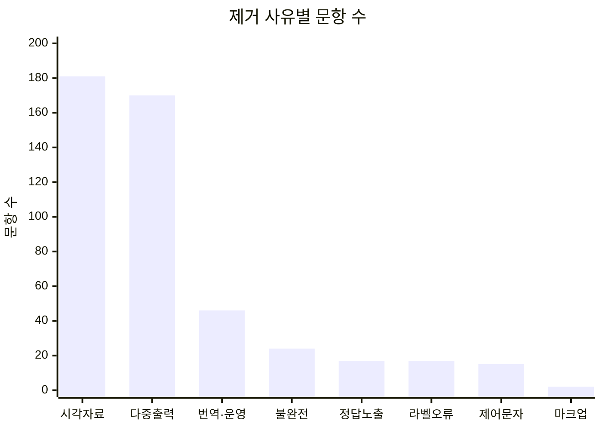

# Deep Challenge Math 학습 데이터 필터링 보고서

작성 기준일: 2026-08-02 (KST)

대상 파일: [`data/deep_chal_math_train.csv`](../../data/deep_chal_math_train.csv)

원본 SHA-256: `e240dcd9752d12143162706cee4818d4025456605c991ece337df6e9abeb869a`

## 요약

원본 17,000개 샘플을 행 단위로 판정하고, 결함 신호가 있는 후보는 질문 원문과 정답 라벨을 함께 검토했다. 텍스트만으로 풀 수 없는 문항, 질문이 손상되거나 다른 지시문이 섞인 문항, 단일 정수 라벨과 구조적으로 호환되지 않는 문항, 정답이 본문에 노출된 문항, 독립 계산으로 라벨 오류가 명백한 문항을 제거했다.

| 결과 | 문항 수 | 원본 대비 |
|---|---:|---:|
| 보존 | 16,528 | 97.22% |
| 제거 | 472 | 2.78% |
| 합계 | 17,000 | 100.00% |

최종 학습용 파일은 [`deep_chal_math_train_filtered.csv`](../../data/deep_chal_math_train_filtered.csv)이다. 원본 파일은 수정하지 않았다.

## 주요 결과

제거 문항의 74.4%는 외부 시각자료 의존 또는 다중 출력 구조에 해당했다. 전자는 이미지·도형·표의 필수 정보가 질문 텍스트에 없고, 후자는 둘 이상의 답이나 증명을 요구해 단일 정수 `answer` 열과 대응할 수 없는 경우다.



아래 표의 `제거 내 비중`은 서로 배타적인 주 사유를 기준으로 계산했다. 한 문항에 여러 결함이 있으면 감사 로그의 `reason_codes`에는 모두 기록하되, 집계에서는 우선순위가 가장 높은 사유 하나만 사용했다.

| 주 사유 | 문항 수 | 제거 내 비중 | 원본 대비 | 판정 기준 |
|---|---:|---:|---:|---|
| 외부 시각자료 의존 | 181 | 38.35% | 1.065% | 누락된 이미지·도형·그래프의 정보가 풀이에 필수 |
| 다중 출력 문항 | 170 | 36.02% | 1.000% | 둘 이상의 답·증명을 요구하여 단일 정수 라벨과 불일치 |
| 번역·시험 운영 지시문 혼입 | 46 | 9.75% | 0.271% | 번역 명령, 배점·시험 운영 문구 등이 수학 문항에 혼입 |
| 불완전·손상 문항 | 24 | 5.08% | 0.141% | 핵심 질문이 없거나 문장이 단편적·모순적 |
| 정답·풀이 노출 | 17 | 3.60% | 0.100% | 질문 본문에 답 또는 완성된 풀이가 포함됨 |
| 검증된 라벨 불일치 | 17 | 3.60% | 0.100% | 독립 계산 결과와 `answer` 라벨이 명백히 다름 |
| 제어문자 손상 | 15 | 3.18% | 0.088% | LaTeX 명령이 탭·백스페이스 등 제어문자로 변형됨 |
| 닫히지 않은 시각 마크업 | 2 | 0.42% | 0.012% | 이미지·도형 마크업이 닫히지 않아 본문이 손상됨 |

## 데이터 범위와 기본 품질

| 항목 | 결과 |
|---|---:|
| 행 수 | 17,000 |
| 열 | `id`, `question`, `answer` |
| 고유 ID | 17,000 |
| 빈 ID·질문·정답 | 0 |
| 완전 동일한 질문 중복 | 0 |
| 정수 형식 정답 | 17,000 |
| 질문 길이 최소 / 중앙값 / 최대 | 8 / 203 / 4,517자 |
| 질문 평균 길이 | 235.9자 |

입력 CSV의 한 행을 한 문항으로 정의했다. 별도의 조인이나 샘플링은 하지 않았고, 최종 파일에는 보존된 원본 행을 같은 순서로 그대로 기록했다.

## 필터링 방법

### 1. 전체 행 단위 검사

17,000개 모든 행에 대해 다음 검사를 실행하고 한 행당 하나의 최종 결정과 근거를 남겼다.

1. 필수 필드, ID 패턴, 정답 정수 형식 검사
2. 제어문자 손상과 닫히지 않은 이미지·도형 마크업 검사
3. 외부 이미지 URL, `asy` 도형 코드, figure/diagram 참조 등 시각자료 신호 검사
4. 번역 프롬프트, 시험 운영·배점 지시문 등 비수학적 문구 검사
5. `(1)/(2)` 또는 `(a)/(b)`가 실제로 각각 별도 답이나 증명을 요구하는지 검사
6. 수동 검토 목록과 독립 계산한 라벨 불일치 목록 대조

단순히 `Figure`라는 단어가 있거나 번호 `(1), (2)`가 있다는 이유만으로 제거하지 않았다. 예를 들어 필요한 길이·각도 정보가 텍스트에도 모두 있으면 보존했고, 번호가 조건이나 설문 문항을 나타내면서 최종 답은 하나뿐인 경우도 보존했다.

### 2. 고위험 후보 원문 검토

직접 이미지·URL이 있는 문항 137개, `asy` 도형 코드가 있는 문항 64개, 이미지 없이 figure/diagram을 참조하는 문항 110개, 번역 잔여 문구 후보 29개, 제어문자 손상 후보 15개를 중심으로 질문과 라벨을 함께 읽어 실제 풀이 가능성을 판단했다. 범주 간 중복이 있으므로 이 수들의 합은 고유 후보 수가 아니다.

대표적인 제거 ID는 다음과 같다.

| 사유 | 예시 ID |
|---|---|
| 외부 시각자료 의존 | `train-000017`, `train-000018`, `train-000046`, `train-000062` |
| 다중 출력 | `train-000113`, `train-000292`, `train-000312`, `train-000403` |
| 번역·운영 지시문 | `train-000864`, `train-001416`, `train-001812`, `train-002069` |
| 불완전·손상 | `train-000189`, `train-000222`, `train-002468`, `train-008273` |
| 정답·풀이 노출 | `train-000672`, `train-002181`, `train-002726`, `train-002754` |
| 제어문자 손상 | `train-001149`, `train-002958`, `train-004054`, `train-004277` |

### 3. 보존 우선 원칙

근거가 명확한 경우만 제거했다. 결함 가능성이 있으나 텍스트만으로 풀이가 가능하거나 라벨 오류를 독립적으로 입증하지 못한 문항은 보존했다. 따라서 이 결과는 과삭제를 줄이는 고정밀 필터이며, 가능한 모든 오류를 공격적으로 제거하는 고재현율 필터는 아니다.

## 독립 계산으로 확인한 라벨 불일치

다음 17개는 질문이 요구하는 값을 직접 다시 계산해 라벨 불일치를 확인했다.

| ID | 원본 라벨 | 독립 계산 결과 | 확인 근거 |
|---|---:|---:|---|
| `train-000284` | 47,190 | 43,758 | $\binom{18}{10}=43,758$ |
| `train-001261` | 1 | 3/4 | $(21/28)(14/33)(99/42)=3/4$ |
| `train-002020` | 1 | 1/8,281 | 곱이 $(1/91)^2$로 망원 소거됨 |
| `train-002691` | 1,006 | 1,015 | 최소 네 자리 35의 배수는 $35\times29$ |
| `train-003196` | 1,952 | 48 | $(28+x/69)69=1,980$에서 $x=48$ |
| `train-004448` | 408,408 | 19,448 | $17!/(7!10!)=\binom{17}{7}$ |
| `train-004479` | 146 | 138 | 자릿수 곱이 24인 최소 세 자리 수는 138 |
| `train-005616` | 258,048 | 0 | $x$의 지수가 0이 되는 정수 선택항이 없음 |
| `train-005884` | 1 | 1이 아님 | $(-3+4i)/5$는 1의 거듭제곱근이 아님 |
| `train-011122` | 5,865,864,355 | 5,865,863,355 | $586,645(10,000-1)$ |
| `train-011387` | 20 | 해가 무한히 많음 | 해집합은 $(-\infty,15]\cup[25,\infty)$ |
| `train-011518` | -10,011 | -99,993 | 통상 정수 순서의 최소 다섯 자리 음수이며, 원본 라벨은 mod 17에서 2 |
| `train-011767` | 1,002,001 | 4 | $(10^3+1)^2=1,002,001$의 자릿수 합 |
| `train-013359` | 135 | $27\cdot5^{3/2}$ | $3^x=\sqrt5$이므로 $27^{x+1}=27(\sqrt5)^3$ |
| `train-014129` | 18 | 2 | $\gcd(256,162,720)=2$ |
| `train-014581` | 19,380 | 38,760 | $\binom{20}{6}=38,760$ |
| `train-016276` | 81 | 162 | 괄호 안 값 54에 3을 곱함 |

`train-012125`는 검증 과정에서 계산값과 라벨이 모두 11임을 재확인해 제거 후보에서 제외했다. 이 역검증은 라벨 오류 목록의 오탐을 줄이기 위해 수행했다.

## 산출물과 재현 방법

| 파일 | 역할 |
|---|---|
| [`deep_chal_math_train_filtered.csv`](../../data/deep_chal_math_train_filtered.csv) | 최종 학습용 데이터 16,528행 |
| [`deep_chal_math_train_filter_audit.csv`](../../data/deep_chal_math_train_filter_audit.csv) | 17,000행 전체의 보존/제거 결정과 근거 |
| [`filter_summary.json`](filter_summary.json) | 입력 해시, 집계, 품질 검사 결과 |
| [`filtering_analysis.ipynb`](filtering_analysis.ipynb) | 실행 완료된 재현·검증 노트북 |
| [`filter_train_data.py`](../../scripts/filter_train_data.py) | 필터링 실행 코드 |

재실행 명령:

```powershell
python scripts/filter_train_data.py
```

감사 로그에는 `id`, 원문 `question`, 원본 `answer`, `decision`, `primary_reason`, 전체 `reason_codes`, 사유 설명, 신뢰도, 시각자료 신호, 근거, 질문 SHA-256을 기록했다. 제거 행을 복원하거나 특정 사유만 다르게 적용하려면 이 파일을 기준으로 결정 목록을 재구성할 수 있다.

## 검증 결과

전체 평가는 **제약사항과 함께 사용 가능(Share with caveats)**이다.

다음 무결성 검사를 모두 통과했다.

- 원본 ID 17,000개가 모두 고유함
- 감사 로그 행 수가 원본과 동일함
- 보존 행 수와 제거 행 수의 합이 17,000임
- 최종 파일 ID가 원본 ID의 부분집합임
- 제거 ID가 최종 파일에 하나도 포함되지 않음
- 최종 파일의 행 순서가 원본 순서와 동일함
- 실행 전후 원본 SHA-256이 동일함
- 검증 노트북의 모든 코드 셀이 순서대로 실행되고 오류 출력이 없음

### 남은 제약사항

- 모든 행은 개별 판정 파이프라인을 통과했고 고위험 후보는 원문 검토했지만, 보존된 16,528개 문항 각각에 대해 완전한 수학 풀이를 새로 작성한 것은 아니다.
- `verified_label_mismatch`는 명백한 17개만 포함한다. 이 목록에 없다는 사실이 라벨의 수학적 정답성을 증명하지는 않는다.
- 외부 그림 신호가 없더라도 문맥이 미세하게 소실된 문항, 또는 복잡한 풀이를 해야만 드러나는 라벨 오류가 남아 있을 수 있다.
- `train-011518`의 “smallest negative integer”는 통상적인 정수 대소관계로 해석했다. 어느 해석에서도 원본 라벨 `-10011`은 $1\pmod{17}$이 아니므로 제거 결정은 유지된다.

## 권장 후속 작업

1. 모델 학습에는 최종 필터 CSV를 사용한다.
2. 제거 기준을 완화하거나 강화할 때는 원본을 직접 수정하지 말고 감사 로그의 `reason_codes`를 기준으로 새 버전을 만든다.
3. 남은 라벨 정확도를 더 높이려면 과목별 수학 풀이 검증기를 추가하고, 보존 문항 중 계산형 문제부터 독립 풀이를 확장한다.
4. 이후 필터 정책을 변경할 경우 `policy_version`, 입력 해시, 제거 ID 차이를 함께 기록한다.
